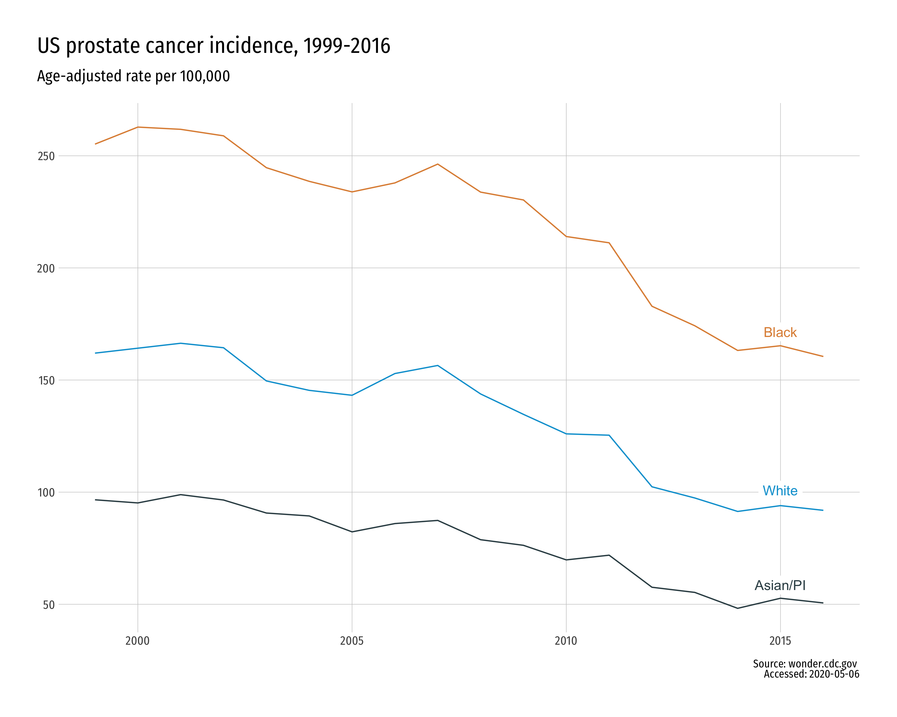

Prostate cancer disparities
=====================
  
For a current project describing racial disparities in prostate cancer outcomes, I needed to plot some CDC incidence data over time. [CDC](https://www.cdc.gov/cancer/dcpc/research/articles/cancer_2020_incidence.htm) does provide the below plot of such data and it's :grimacing:.

Since that won't do, I need to roll my own. You can get the underlying incidence data from [https://wonder.cdc.gov/](https://wonder.cdc.gov/).

In short order, I came up with the following the ggplot version.

For kicks, I thought I would spend the same amount of time doing what I did for the better part of a decade: doing this same plot in base R. The result is still better than the CDC version, but it doesn't come close to the shine of the ggplot figure.

