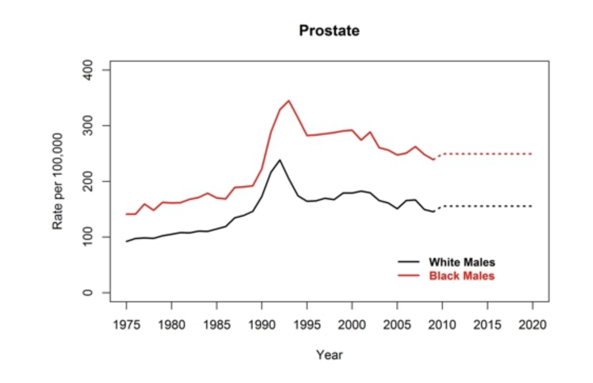
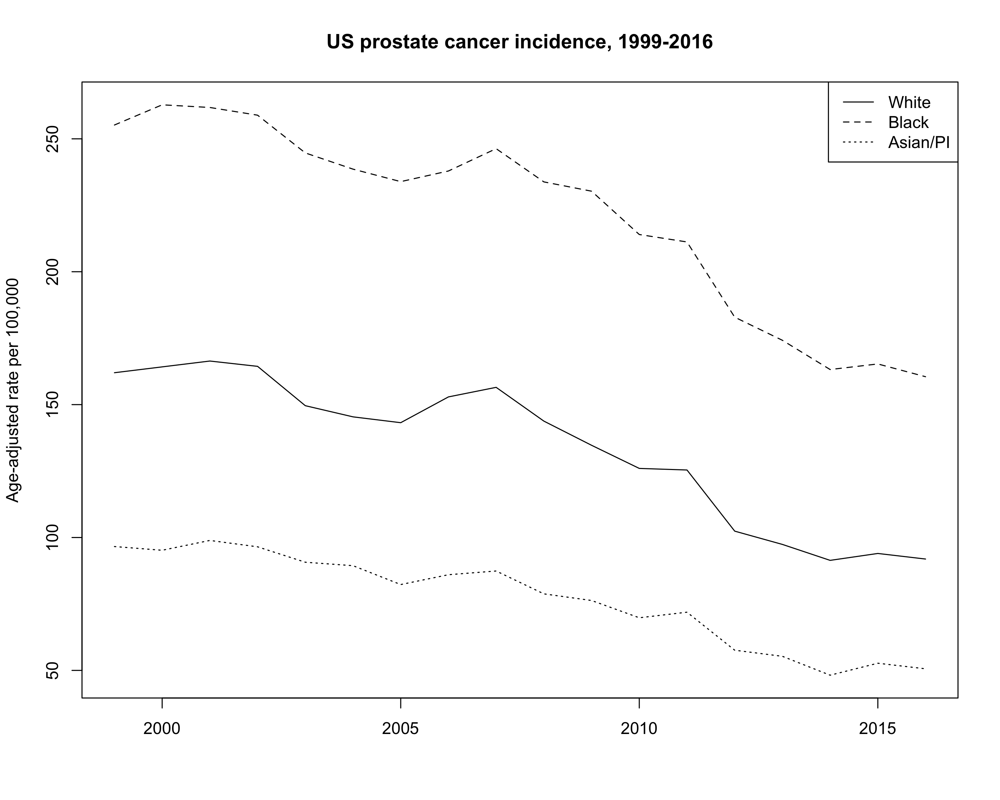

Prostate cancer disparities
=====================
  
For a current project describing racial disparities in prostate cancer outcomes, I needed to plot some CDC incidence data over time. [CDC](https://www.cdc.gov/cancer/dcpc/research/articles/cancer_2020_incidence.htm) does provide the below plot of such data and it's :grimacing:.

Since that won't do, you can get actual from [https://wonder.cdc.gov/](https://wonder.cdc.gov/).

